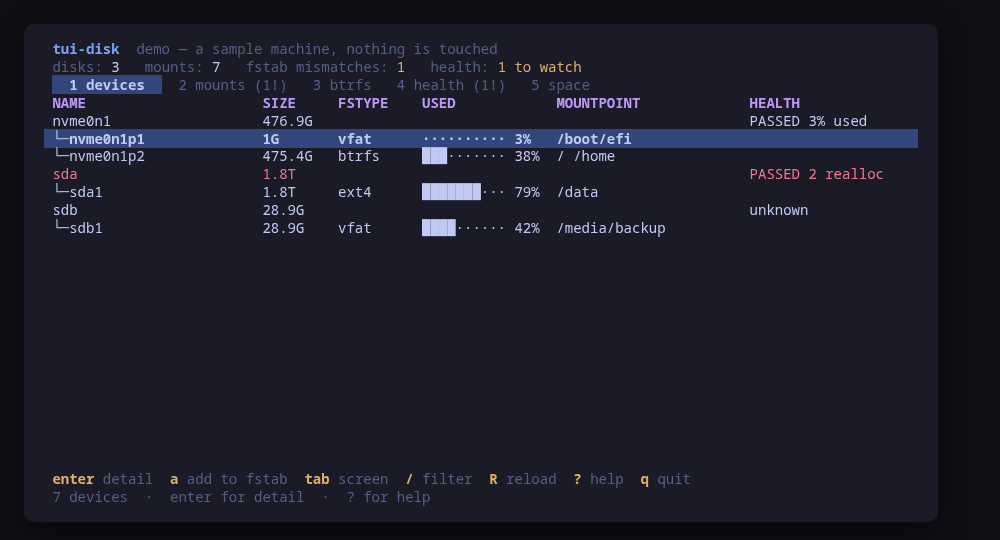
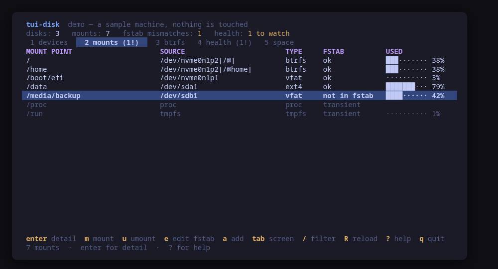
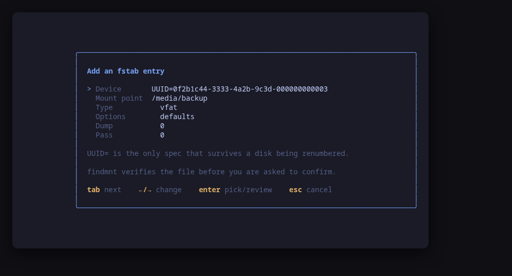
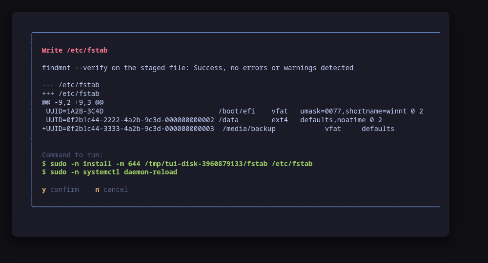
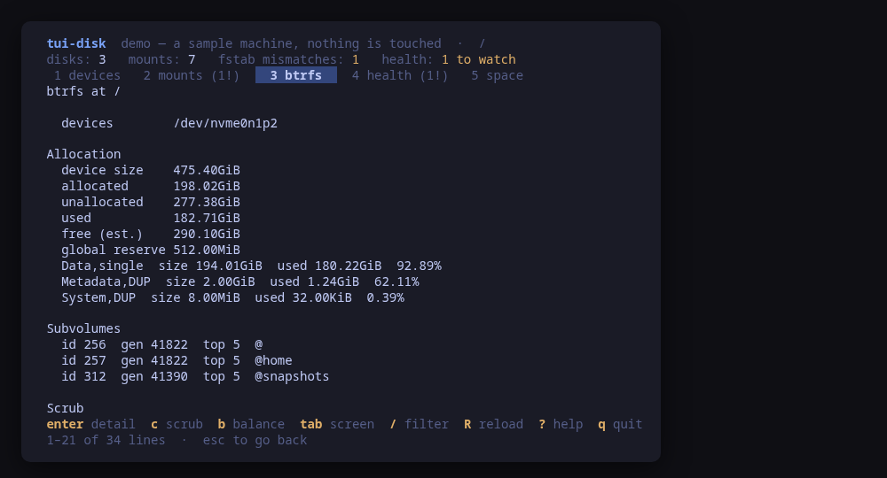
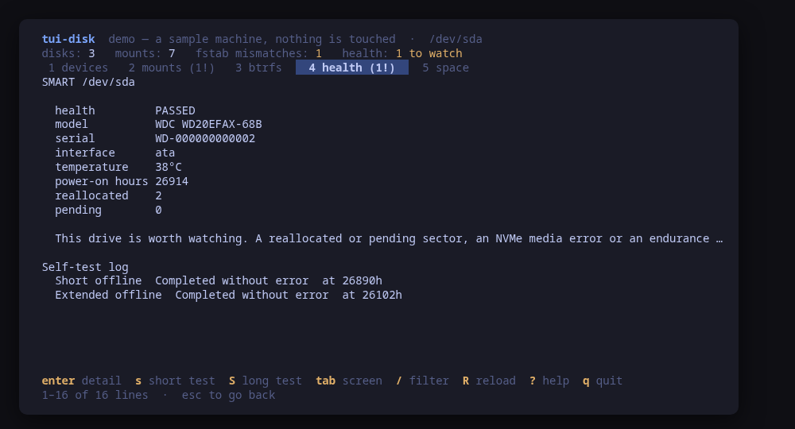

A terminal UI for the machine's storage. The disks you actually have, the mount
table crossed against `/etc/fstab`, the btrfs filesystems in full and the SMART
health of every drive — on one screen, and **every change is previewed as the
exact command line before it runs**.

Five programs answer these questions today, in five different terminals:
`lsblk`, `findmnt`, `df`, `btrfs` and `smartctl`. `tui-disk` puts them on one
screen, in the [Omarchy](https://omarchy.org) visual style.



> **Status: early, under validation.** An independent tool that follows the
> Omarchy visual style; it is **not** part of the Omarchy project and not
> endorsed by its maintainers. Expect rough edges.

## Install

<!-- install:start -->
<!-- Generated by tui-kit/tools/render-install.py from tool.json. -->
<!-- Edit the manifest, then run `make readme`. -->

### Any distribution, static binary

```sh
curl -fsSL https://github.com/tui-tools/tui-disk/releases/download/v0.1.0/tui-disk_0.1.0_linux_amd64.tar.gz | tar -xz tui-disk
sudo install -m0755 tui-disk /usr/local/bin/tui-disk
```

One static binary. Verify it against checksums.txt from the same release.

### From source

```sh
git clone https://github.com/tui-tools/tui-disk
cd tui-disk && make build
sudo install -m0755 bin/tui-disk /usr/local/bin/tui-disk
```

Needs Go 1.27 or newer.

The distribution packages are not published yet. The commands below are here so
you know what they will be; a package repository at `pkgs.tui.tools` is what
turns them on.

### Arch Linux — coming soon

Needs the tui-tools repository, which is a [one-time
setup](https://tui-tools.github.io/install/).

The one-liner detects the distribution and adds the repository and its signing
key:

```sh
curl -fsSL https://pkgs.tui.tools/install.sh | sh
```

Piping a script into a shell is not this family's style, so here is the same
setup by hand — read it, or read the script first with `curl -fsSL
https://pkgs.tui.tools/install.sh -o install.sh`:

```sh
curl -fsSL -o /tmp/tui-tools.asc https://pkgs.tui.tools/pubkey.asc
sudo pacman-key --add /tmp/tui-tools.asc
sudo pacman-key --lsign-key \
  "$(gpg --show-keys --with-colons /tmp/tui-tools.asc | awk -F: '/^fpr:/{print $10; exit}')"
printf '[tui-tools]\nServer = https://pkgs.tui.tools/arch/$arch\n' \
  | sudo tee -a /etc/pacman.conf
sudo pacman -Sy
```

Then, and for every other tool in the family:

```sh
sudo pacman -S tui-disk
```

Upgrades then arrive with the rest of your system updates.

### Arch Linux (AUR) — coming soon

```sh
paru -S tui-disk-bin
```

The -bin package installs the released static binary.

### Debian and Ubuntu — coming soon

Needs the tui-tools repository, which is a [one-time
setup](https://tui-tools.github.io/install/).

The one-liner detects the distribution and adds the repository and its signing
key:

```sh
curl -fsSL https://pkgs.tui.tools/install.sh | sh
```

Piping a script into a shell is not this family's style, so here is the same
setup by hand — read it, or read the script first with `curl -fsSL
https://pkgs.tui.tools/install.sh -o install.sh`:

```sh
sudo install -d -m 0755 /etc/apt/keyrings
curl -fsSL https://pkgs.tui.tools/pubkey.asc \
  | sudo gpg --dearmor -o /etc/apt/keyrings/tui-tools.gpg
echo "deb [signed-by=/etc/apt/keyrings/tui-tools.gpg] https://pkgs.tui.tools/deb stable main" \
  | sudo tee /etc/apt/sources.list.d/tui-tools.list
sudo apt update
```

Then, and for every other tool in the family:

```sh
sudo apt install tui-disk
```

Upgrades then arrive with the rest of your system updates.

### Fedora and RHEL — coming soon

Needs the tui-tools repository, which is a [one-time
setup](https://tui-tools.github.io/install/).

The one-liner detects the distribution and adds the repository and its signing
key:

```sh
curl -fsSL https://pkgs.tui.tools/install.sh | sh
```

Piping a script into a shell is not this family's style, so here is the same
setup by hand — read it, or read the script first with `curl -fsSL
https://pkgs.tui.tools/install.sh -o install.sh`:

```sh
sudo rpm --import https://pkgs.tui.tools/pubkey.asc
sudo curl -fsSL -o /etc/yum.repos.d/tui-tools.repo https://pkgs.tui.tools/rpm/tui-tools.repo
sudo dnf makecache
```

Then, and for every other tool in the family:

```sh
sudo dnf install tui-disk
```

Upgrades then arrive with the rest of your system updates.

### openSUSE — coming soon

Needs the tui-tools repository, which is a [one-time
setup](https://tui-tools.github.io/install/).

```sh
sudo zypper install tui-disk
```

The rpm repository is shared with dnf; zypper support is not tested yet.

### Verify a download

Every release of `tui-disk` ships a `checksums.txt`. Check an archive against
it before installing:

```sh
sha256sum -c checksums.txt --ignore-missing
```
<!-- install:end -->

One static binary, no daemon, no state of its own. Nothing keeps running after
you quit.

## Try it without root

```sh
tui-disk --demo
```

`--demo` runs against a sample machine: an NVMe root on btrfs with three
subvolumes, a spinning data disk whose SMART already carries two reallocated
sectors, and a USB stick somebody mounted by hand that no `fstab` entry covers.
Two of those three are exactly what the tool exists to surface. Every key works,
every command is built and previewed for real, and nothing touches your system.

## What is mounted, against what will be



This is the screen that earns its keep. `findmnt` says what is mounted now;
`/etc/fstab` says what will be mounted next boot. The interesting rows are the
ones where those two disagree, and each gets a verdict:

| Verdict | What it means |
| --- | --- |
| `ok` | mounted, in fstab, with the options fstab asks for |
| `not in fstab` | mounted by hand — it will not come back after a reboot |
| `not mounted` | in fstab and not mounted: the boot that failed and nobody noticed |
| `options differ` | mounted, but without an option the file asks for |
| `transient` | a kernel or runtime mount nobody puts in fstab |

`transient` is there so the count stays honest. A screen that flagged every
`proc`, `cgroup2` and `/run/user/1000` would bury the two rows that matter under
forty that never will, so those are classified and set aside rather than
counted. The same care goes into `options differ`: `umask` on a vfat mount is
expanded by the kernel into `fmask` and `dmask` and never echoed back, and
`defaults` expands to several flags — neither is a mismatch, and a tool that
said otherwise would flag the ESP on every machine in the world.

Open a row and you get the mount, the fstab line behind it, which options are
not in effect, and the output of `findmnt --verify` on the whole file.

## Editing fstab, safely



`a` picks a device by UUID, `e` edits the entry for the row you are on. The
form writes one line: the device spec, the mount point, the type, an options
preset (`defaults`, `noatime`, `compress=zstd:1` for btrfs, `nofail`,
`x-systemd.automount`) and the two numeric fields.

Then the part that matters:



The new file is written to a private temporary directory, **`findmnt --verify
--tab-file` is run against that staged copy**, and only a file that passed
reaches the confirm dialog. You cannot approve an fstab that would not parse,
because one never gets that far — and on the real file, a line that does not
parse is a boot that drops to an emergency shell.

What you then see is a unified diff of the one line that changed, and the two
commands that apply it: `install -m 644` from the staged file, then `systemctl
daemon-reload` so the mount and automount units systemd generates from fstab
match the file again. `y` runs them, `n` does not.

## btrfs, in full



Per filesystem: the allocation from `btrfs filesystem usage`, the subvolumes,
the quota groups when quotas are on, the scrub and balance state, and the
per-device error counters — with the corruption and generation counters flagged,
because those two mean the data itself was wrong rather than the transport.

`c` starts a scrub and `C` cancels one. `b` asks which block groups to balance
(`dusage=10` reclaims the mostly-empty ones, which is the balance nearly
everybody actually wants) and warns that it holds the disk for hours. Both are
started in the background: a TUI that waited for a scrub of a full disk would be
a TUI that hung, so the status is read back on the next refresh instead.

## Drive health



`smartctl --json` per drive: the self-assessment, the temperature, the power-on
hours, and the counters that predict a failure — reallocated and pending sectors
on ATA, endurance used and media errors on NVMe. A drive that says `PASSED` and
carries two reallocated sectors is already working around damage, so the column
shows the number next to the verdict rather than the verdict alone.

`s` and `S` start a short or extended self-test; the drive runs it itself and
the result lands in the log this screen shows.

A drive that cannot be asked comes back `unknown` **with the reason** — a USB
bridge that passes no SMART through, a virtual disk that has no firmware, or a
`sudo -n` that would have prompted. That is the honest answer, and it is not the
same as healthy.

## Space

Per mounted filesystem, what `df` says, with a bar. What is *filling* a
filesystem is a question v0.1 does not answer: it names `ncdu -x <mount>` and
points at it, because walking a tree is not something a preview-and-confirm tool
should be doing behind your back.

## Usage

```sh
tui-disk                          # drive the real machine
tui-disk --demo                   # sample machine, no privileges needed
tui-disk --check                  # read the storage, print JSON, exit
tui-disk --theme ~/mytheme/colors.toml
tui-disk --sudo ""                # run the commands directly (as root)
tui-disk --version
```

### `--check`, for scripts and tests

`--check` is the non-interactive read path: it loads the storage through the
same backend the UI would use, prints the parsed model as JSON and exits 0, or
exits 1 with the reason if the backend cannot be read. No UI, and it never
builds or runs a mutation, so it is safe to run anywhere.

```console
$ tui-disk --check | head -14
{
  "tool": "tui-disk",
  "version": "0.1.0",
  "backend": "util-linux",
  "describe": "lsblk via /usr/bin/sudo -n",
  "devices": 18,
  "disks": 4,
  "mounts": 34,
  "fstabEntries": 5,
  "fstabMismatches": 1,
  "mismatchTargets": [
    "/ntfs_dados"
  ],
  "btrfsFilesystems": 1,
```

It exists so a test can assert on what the tool *parsed* rather than on what it
painted: that the device count matches `lsblk`, that the mismatch it found is
the mount you know is wrong, that the btrfs error counters are zero, and that a
drive with no SMART came back `unknown` with a reason rather than silently
healthy.

[tui-lab](https://github.com/tui-tools/tui-lab) uses it to test this tool
against real machines on Ubuntu, Fedora and Omarchy Server; the assertions live
in [`test/smoke.sh`](test/smoke.sh).

## What needs root

Most reads do not. `lsblk`, `findmnt`, `df`, `btrfs filesystem usage`, `btrfs
scrub status` and `btrfs device stats` all answer to any user, and `tui-disk`
does not escalate to run them.

Five reads genuinely cannot answer an ordinary user, so they are tried plain
first and retried with `sudo -n` — which never prompts — only when the answer
comes back as a permission failure:

| Read | What an unprivileged call gets |
| --- | --- |
| `blkid -o export` | an empty body, and exit status 0 |
| `btrfs subvolume list` | `ERROR: can't perform the search` |
| `btrfs qgroup show` | `ERROR: can't list qgroups` |
| `btrfs balance status` | `Operation not permitted` |
| `smartctl -a` | it needs the raw device |

A machine where `sudo -n` would prompt loses those sections, keeps everything
else, and says which in the status line and the help screen. The device picker
falls back to the UUIDs `lsblk` already reported, so the fstab editor still
works. Nothing silently shows an empty screen: that failure mode is why this is
spelled out here.

## What it can do to your machine

Every one of these is previewed and confirmed first.

| Key | What runs |
| --- | --- |
| `m` | `mount <target>` |
| `u` | `umount <target>` |
| `D` | `systemctl daemon-reload` |
| `e` / `a` | `install -m 644 <staged file> /etc/fstab`, then `systemctl daemon-reload` |
| `c` / `C` | `btrfs scrub start <mount>` / `btrfs scrub cancel <mount>` |
| `b` / `B` | `btrfs balance start [-dusage=N] --bg <mount>` / `btrfs balance cancel <mount>` |
| `s` / `S` | `smartctl --test=short <device>` / `smartctl --test=long <device>` |

Nothing else. Mounting is `mount <target>` and nothing more, on purpose: the
kernel reads the device and the options out of fstab, so what gets mounted is
exactly what the file says rather than something this tool made up. And there is
no code path that writes to `/etc` other than that `install`, whose destination
is the constant `/etc/fstab`.

## Keys

| Key | Action |
| --- | --- |
| `1`…`5` | Devices, mounts, btrfs, health, space |
| `tab` / `shift+tab` | Next / previous screen |
| `↑`/`k`, `↓`/`j` | Move the selection, or scroll the detail screen |
| `g` / `G` | First / last row |
| `pgup` / `pgdn` | Scroll a page |
| `enter` | Open the selected row in full |
| `esc` | Leave the detail screen |
| `/` | Filter this screen (matches any column; `esc` clears) |
| `m` / `u` | Mount / unmount the selected fstab entry |
| `e` | Edit the fstab entry for the selected row |
| `a` | Add an fstab entry, picking the device by UUID |
| `D` | Reload the systemd units generated from fstab |
| `c` / `C` | Start / cancel a btrfs scrub |
| `b` / `B` | Start / cancel a btrfs balance |
| `s` / `S` | Start a short / extended drive self-test |
| `R` | Re-read the storage |
| `?` | Help |
| `q` | Quit |

In the **fstab** form: `tab` / `shift+tab` move between fields, `←`/`→` cycle a
choice, `enter` opens a picker on a choice field and submits from a text field,
`esc` cancels.

## What v0.1 can do

- Read the block device tree from `lsblk -J`, with size, filesystem, usage,
  label, UUID, model, serial, transport and the rotational flag, and a usage
  bar per filesystem.
- Cross the mount table from `findmnt -J` against `/etc/fstab` and mark every
  disagreement, with the fstab line and `findmnt --verify` on the detail screen.
- Mount and unmount an fstab entry, previewed.
- Add or edit an fstab entry from a guided form — device by UUID, mount point,
  type, an options preset — validated with `findmnt --verify` against the
  staged file *before* the confirm, shown as a unified diff, installed with
  `install -m 644` and applied with `systemctl daemon-reload`.
- Show each btrfs filesystem's allocation, subvolumes, quota groups, scrub and
  balance state and per-device error counters; start and cancel a scrub, start
  a filtered or full balance and cancel it.
- Read every drive's SMART: health, temperature, power-on hours, reallocated
  and pending sectors on ATA, endurance and media errors on NVMe, and the
  self-test log; start a short or extended self-test.
- Show `df` per mounted filesystem, and point at `ncdu` for what fills one.
- Follow the active Omarchy theme, and respect `NO_COLOR`.

## What v0.1 cannot do

- **It never partitions anything.** No `parted`, no `mkfs`, no `wipefs`, no
  LUKS. Creating and destroying filesystems is not a thing to put behind a
  keystroke, and it is not on the roadmap.
- **No free-form fstab editing.** The form writes the fields it knows; the file
  is shown whole on the mounts detail screen, and anything else is a job for
  `$EDITOR`. Every other line is copied through byte for byte, so a rewrite
  never touches the rest of the file.
- **No LVM, no mdadm, no ZFS.** Their volumes appear in the device tree because
  `lsblk` reports them; none of them has a view of its own.
- **No directory sizes.** The space screen is `df` and a pointer to `ncdu`;
  nothing recurses.
- **No btrfs subvolume creation, deletion or snapshots.** That is
  [tui-snapper](https://github.com/tui-tools/tui-snapper)'s job.
- **No SMART attribute editing**, no `-t select`, no offline test scheduling.

## Compatibility

<!-- compat:start -->
<!-- Generated by tui-kit/tools/render-compat.py from tool.json. -->
<!-- Edit the manifest, then run `make readme`. -->

`tui-disk` probes its backend once at startup and shows the version in the
header. A version nobody has tested is marked `(untested)` there rather than
hidden; one below the minimum is marked as such and the tool still runs.

### util-linux

| | |
| --- | --- |
| Binary | `lsblk` |
| Version read with | `lsblk --version` |
| Minimum | 2.34 |
| Tested | `2.39.3`, `2.41.5`, `2.42.2` |
| Version-gated features | `mountpoints` (since 2.37) |

| Versions | What changes |
| --- | --- |
| `<2.37` | lsblk has no `MOUNTPOINTS` column, so the single-valued `MOUNTPOINT` is asked for instead; a device mounted at several paths reports only the first one. lsblk fails the whole call on a column name it does not know, so this is a gate rather than a fallback |
| `>=2.34` | `blkid` reads /dev directly and answers an unprivileged caller with an empty body and exit 0, so the fstab editor's device picker escalates with `sudo -n` and falls back to the UUIDs lsblk already reported when it cannot |

### btrfs-progs

| | |
| --- | --- |
| Binary | `btrfs` |
| Version read with | `btrfs --version` |
| Minimum | 5.10 |
| Tested | `6.6.3`, `6.19.1`, `7.1` |
| Version-gated features | `json-output` (since 5.15) |

| Versions | What changes |
| --- | --- |
| `>=5.10` | `--format json` is supported per command, not globally: `device stats` and `filesystem df` emit JSON, while `filesystem usage`, `subvolume list`, `scrub status` and `balance status` refuse it through 6.19 at least, so those four are read from their text output |
| `>=5.10` | `subvolume list`, `qgroup show` and `balance status` refuse an unprivileged caller with "Operation not permitted"; they are retried with `sudo -n`, and a machine that cannot escalate shows those sections empty with a note saying so |
| `<5.15` | no `--format json` at all, so `device stats` is read from its text output too |

### smartmontools

| | |
| --- | --- |
| Binary | `smartctl` |
| Version read with | `smartctl --version` |
| Minimum | 7.0 |
| Tested | none yet |
| Version-gated features | `json-output` (since 7.0) |

| Versions | What changes |
| --- | --- |
| `<7.0` | `smartctl --json` does not exist, and the health of every drive is reported as unknown rather than scraped out of a table meant for human eyes |
| `>=7.0` | reading SMART needs the raw device, so it escalates with `sudo -n`; a drive behind a USB bridge that passes no SMART through, and a virtual disk that has no firmware, both come back unknown with the reason smartctl gave |

The tested versions are generated from `compat/results.jsonl`, which the tool's
own smoke test appends to when it runs against a real machine in
[tui-lab](https://github.com/tui-tools/tui-lab).
<!-- compat:end -->

## Configuration

`/etc/tui-disk/config.toml`, then `~/.config/tui-disk/config.toml` (the user
file overrides the machine-wide one), then `TUI_DISK_*` in the environment.
Flags override everything. See [`examples/config.toml`](examples/config.toml).

```toml
# Privilege escalation prefix; "" runs the command directly.
sudo = "sudo -n"

# Path to an Omarchy-style colors.toml; empty follows the active theme.
theme = ""
```

## Theme

The default palette is **Tokyo Night**. On Omarchy, the tool reads the active
desktop theme from `~/.config/omarchy/current/theme/colors.toml` and follows it.
`TUI_THEME` or `--theme` override; `NO_COLOR` drops color and keeps layout. The
rules live in [tui-kit](https://github.com/tui-tools/tui-kit#theme-rules).

## Architecture

The UI never builds an `lsblk`, `btrfs` or `smartctl` command line. It talks to
`internal/disk.Backend`, which returns a tool-neutral model:

```
Model{Devices, Mounts, Fstab, Btrfs, SMART, Space, Notes}
Device{Name, KName, Kind, Size, FSType, FSUsed, Mountpoints, Label, UUID,
       Model, Serial, Rotational, Transport, Children, Health}
Mount{Target, Source, FSType, Options, Mounted, InFstab, FstabLine, Match}
Btrfs{Mountpoint, Usage, Subvolumes, Qgroups, Scrub, Balance, DeviceStats}
SMART{Device, Available, Kind, Health, Temperature, PowerOnHours,
      ReallocatedSectors, PendingSectors, PercentageUsed, MediaErrors, SelfTests}
```

`internal/storage` is the only package that starts a process, and
[`check-exec.sh`](https://github.com/tui-tools/tui-kit/blob/main/tools/check-exec.sh)
fails the build if any other package imports `os/exec`.

Mutations are `runner.Command` values produced by the backend. The UI shows them
and, on confirmation, hands the same ones back to the
[kit runner](https://github.com/tui-tools/tui-kit#the-contract-preview-confirm-run),
which resolves the binary and the privilege prefix. That is the whole trust
boundary, and it is why the preview is guaranteed to match what executes.

## Development

```sh
make check        # gofmt, go vet, the exec boundary and the tests: what CI runs
make test
make build
make demo
make screenshots  # re-render the frames above from --demo
```

The parser tests run against captured output from real machines
(`internal/storage/testdata`), with the serial numbers rewritten. The `smartctl`
reports are built from the smartmontools JSON schema, because the machine the
fixtures were captured on has no passwordless `sudo` and SMART cannot be read
without one.

Dependencies are deliberately small: Bubble Tea, Bubbles and
[tui-kit](https://github.com/tui-tools/tui-kit), which carries the palette, the
widgets, the config loader and the command runner shared by the whole family.

## Safety notes

- Unmounting stops whatever was writing under that path, and a process holding a
  file open keeps the mount busy. The confirm dialog says so before you agree.
- A balance rewrites every block group it matches: on a full filesystem it runs
  for hours and holds the disk the whole time. The dialog is painted in the
  danger colour for that reason, not because it loses data.
- `/etc/fstab` is staged in a private temporary directory, verified there, and
  installed only by the `install` you approved. Every line other than the one
  you edited is copied through unchanged.
- Adding an entry for a mount point the file already covers is refused, not
  merged: two answers for one mount point is a machine that mounts whichever the
  kernel read last.
- `tui-disk` re-reads the storage after every change, so what you see is what
  the system reports, not what the tool assumed.

## License

MIT — see [LICENSE](LICENSE). Part of the
[tui-tools](https://github.com/tui-tools) family.
